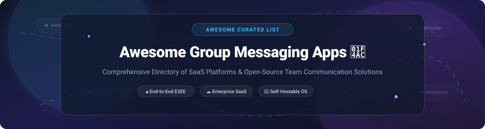

# 💬 Awesome Group Messaging Apps

  
  
  
  
  

---

## 📌 Overview & SEO Insights

Welcome to the definitive, community-curated directory of **Group Messaging Apps**, **Team Communication Software**, and **Self-Hosted Open-Source Messaging Solutions**. Whether you are building an enterprise workplace, managing a global community, or setting up a privacy-focused decentralized chat server, this list details top commercial SaaS platforms and production-proven open-source GitHub repositories.

* **Key Categories**: Workplace Team Chat, Community Platforms, End-to-End Encrypted (E2EE) Messaging, Decentralized & Federated Protocols, Self-Hosted Slack/Discord Alternatives.
* **Target Audience**: CTOs, DevOps Engineers, System Administrators, Community Managers, Privacy Advocates, and Developers.

---

## 📖 Table of Contents

- [☁️ SaaS & Commercial Group Messaging Platforms](#%EF%B8%8F-saas--commercial-group-messaging-platforms)
- [🔓 Open-Source & Self-Hosted GitHub Repositories](#-open-source--self-hosted-github-repositories)
- [🤝 How to Contribute](#-how-to-contribute)
- [⚠️ Disclaimer & Compliance](#%EF%B8%8F-disclaimer--compliance)
- [📈 Star History](#-star-history)
- [💖 Support & Community](#-support--community)

---

## ☁️ SaaS & Commercial Group Messaging Platforms

> 📊 **Market Context & Industry Dynamics**: The global group messaging and team collaboration market is estimated at **~$70 Billion in 2026** and is projected to expand to **~$150 Billion by 2032** (CAGR ~13.5%). The sector is **moderately fragmented**: consumer chat is dominated by tech giants (Meta's WhatsApp, Tencent's WeChat, Telegram), workplace communications are led by enterprise giants (Salesforce's Slack, Microsoft Teams), while community-first spaces (Discord) and privacy-first tools (Signal) own distinct segments. No single platform occupies a winner-take-all monopoly, as organizations and consumers routinely utilize complementary tools across different social and professional domains.

The table below lists leading commercial SaaS products sorted by **Company Size (Market Capitalization / Valuation / Revenue)** in **descending order**:

| Platform 🚀 | Key Description 📝 | Starting Pricing Tier 💰 | Free Tier Limits 🎁 | Company Size (Valuation / Revenue) 🏢 |
| :--- | :--- | :--- | :--- | :--- |
| **[GroupMe](https://groupme.com/)** | **Simple, ubiquitous group messaging.** Features polls, event scheduling, media sharing, and cross-platform SMS integration. | **$0.00 / month** (100% Free core service) | **Free Forever**: Unlimited group members, unlimited groups, polls, event tracking, reactions, media sharing, zero ads. Optional in-app emoji packs ($0.99–$1.99). | **~$3.1 Trillion Market Cap** (Parent: Microsoft / Skype) |
| **[WhatsApp](https://www.whatsapp.com/)** | **World's largest messaging platform.** Default end-to-end encryption, Communities, group voice/video calls, and document sharing. | **$0.00 / month** (100% Free consumer tier) | **Free Forever**: Group chats up to **1,024 members**, 32-person video calls, E2EE security, Communities linking multiple groups. | **~$1.5 Trillion Market Cap** (Parent: Meta / ~$165B Annual Revenue) |
| **[WeChat](https://www.wechat.com/)** | **Dominant super-app in Asia.** Seamlessly combines group messaging, voice/video calls, mini-programs, and digital payments. | **$0.00 / month** (100% Free base app) | **Free Forever**: Group chats up to **500 members**, 15-person group video calls, Moments feed, Official Accounts, WeChat Pay integration. | **~$450 Billion Market Cap** (Parent: Tencent / ~$100B Annual Revenue) |
| **[Slack](https://slack.com/)** | **Industry standard enterprise workspace chat.** Organized channels, threaded replies, huddles, 2,600+ app integrations, and workflow automation. | **$7.25 / user / month** (Annual billing; $8.75 monthly) | **Free Tier**: **90-day searchable message history**, up to 10 app integrations, 1:1 external huddles, SAML/SCIM SSO support. | **~$300 Billion Market Cap** (Parent: Salesforce / ~$37.9B Annual Revenue) |
| **[Discord](https://discord.com/)** | **Leading community and voice platform.** Rich server structures, text/voice/video channels, custom roles, and low-latency streaming. | **$4.99 / month** (Nitro Basic) or **$9.99 / month** (Full Nitro) | **Free Forever**: Up to **100 servers**, unlimited text messages & history, 25-person video calls, screen sharing (720p/30fps), 8MB file uploads. | **~$15 Billion Valuation** (Private / Venture Backed) |
| **[Viber](https://www.viber.com/)** | **Global messaging & voice platform.** Supports large Communities, broadcast Channels, HD group calls, and interactive polls. | **$0.00 / month** (Free base platform) | **Free Forever**: Group chats up to **250 members**, unlimited Community members, 60-person group audio calls, end-to-end encryption. | **~$12 Billion Market Cap** (Parent: Rakuten Group / ~$14B Revenue) |
| **[Telegram](https://telegram.org/)** | **Feature-packed cloud messaging.** Supports massive groups, public broadcast channels, interactive bots, and 2GB file sharing. | **$4.99 / month** (Telegram Premium for 4GB uploads & speed) | **Free Forever**: Group chats up to **200,000 members**, unlimited channel subscribers, 2GB single file uploads, cloud sync across all devices. | **~$10 Billion Valuation** (Private / Independent) |
| **[Line](https://line.me/)** | **Leading team & social messenger in Japan/Taiwan.** Rich sticker ecosystem, group voice/video calls, and social timeline feeds. | **$0.00 / month** (Free consumer application) | **Free Forever**: Groups up to **500 members**, OpenChat rooms up to **5,000 members**, Letter Sealing E2EE encryption, group voice/video calls. | **~$8 Billion Market Cap** (Parent: LY Corporation / Z Holdings) |
| **[Band](https://band.us/)** | **Group organization & community management.** Feeds, shared calendars, polls, attendance lists, file libraries, and live streams. | **$0.00 / month** (Free base suite) | **Free Forever**: Unlimited group members, shared group calendars, polls, notice boards, file storage, live video streaming. Storage add-ons ($19.99/6mo). | **~$7 Billion Market Cap** (Parent: Naver / ~$2B+ Revenue) |
| **[Signal](https://signal.org/)** | **The gold standard for private communication.** Default end-to-end encryption, zero tracking, zero metadata retention, non-profit backed. | **$0.00 / month** (Non-profit foundation, no paid tiers) | **Free Forever**: Group chats up to **1,000 members**, group video calls up to **50 participants**, disappearing messages, zero advertisements. | **Non-Profit Foundation** (~$50M+ Annual Operating Budget & Endowment) |

---

## 🔓 Open-Source & Self-Hosted GitHub Repositories

> 💡 **The Open-Source Advantage**: Self-hosted and open-source group messaging platforms deliver complete data sovereignty, custom security auditing, GDPR/HIPAA compliance, and zero per-user subscription fees.

The table below features top open-source projects sorted by **GitHub Stars_Count** in **descending order**:

| Repository 📦 | Project & Key Description 🛠️ | GitHub_Stars 🌟 |
| :--- | :--- | :--- |
| **[Rocket.Chat](https://github.com/RocketChat/Rocket.Chat)** | **The ultimate open-source Slack alternative.** Enterprise team chat, audio/video conferencing, LiveChat, omnichannel customer support, matrix federation, and LDAP sync. **MIT License**. |  |
| **[Mattermost](https://github.com/mattermost/mattermost)** | **Self-hosted developer workplace messaging.** Unlimited users & message history on free tier, single Linux binary deployment, PostgreSQL database, and enterprise security compliance. **AGPLv3 / MIT**. |  |
| **[Zulip](https://github.com/zulip/zulip)** | **Organized topic-based team chat.** Combines real-time chat with asynchronous email-like threading. Apache 2.0 licensed, 100% open source, used by open-source communities worldwide. |  |
| **[Signal Server](https://github.com/signalapp/Signal-Server)** | **Official server backend for Signal Messenger.** High-performance Java engine powering default end-to-end encrypted messaging, group state management, and sealed sender routing. **AGPLv3**. |  |
| **[Matrix Synapse](https://github.com/matrix-org/synapse)** | **Reference homeserver implementation for Matrix.** Powers decentralized, federated group communication across millions of matrix users worldwide. **Apache 2.0**. |  |
| **[Element (Matrix)](https://github.com/element-hq/element-web)** | **Flagship web client for the Matrix protocol.** Decentralized, end-to-end encrypted messaging, cross-signing security, group video calls, and bridges to Slack, WhatsApp, and Telegram. **Apache 2.0**. |  |
| **[Fosscord / Spacebar](https://github.com/spacebarchat/server)** | **Open-source Discord-compatible communication server.** Drop-in replacement server supporting native Discord API endpoints, voice channels, and self-hosted instances. **AGPLv3**. |  |
| **[Stoat / Revolt](https://github.com/revoltchat/revolt)** | **Privacy-focused Discord alternative.** Built for community servers with text/voice channels, role permissions, custom emojis, and zero invasive telemetry. **AGPLv3**. |  |
| **[SimpleX Chat](https://github.com/simplex-chat/simplex-chat)** | **100% private messaging network with no user IDs.** Uses unidirectional message queues rather than user identifiers, ensuring unmatched metadata privacy for 1:1 and group chats. **GPLv3**. |  |
| **[Jitsi Meet](https://github.com/jitsi/jitsi-meet)** | **WebRTC video conferencing with built-in group chat.** 100% open source, fully encrypted video calls, screen sharing, etherpad document collaboration, and zero account requirement. **Apache 2.0**. |  |
| **[Delta Chat](https://github.com/deltachat/deltachat-core-rust)** | **Decentralized messaging powered by standard email servers.** Uses existing email infrastructure (IMAP/SMTP) with automatic Autocrypt end-to-end encryption for group messaging. **GPLv3**. |  |
| **[Nextcloud Talk](https://github.com/nextcloud/spreed)** | **Self-hosted chat & video meeting suite.** Deeply integrated into Nextcloud ecosystem for seamless file sharing, group video webinars, screen sharing, and mobile notifications. **AGPLv3**. |  |
| **[Campfire](https://github.com/basecamp/campfire)** | **Lightweight self-hosted team chat from 37signals/Basecamp.** Simple, zero-subscription group chat software designed for quick deployment and straightforward team messaging. **MIT License**. |  |
| **[Guardyn](https://github.com/guardyn/guardyn)** | **Post-quantum end-to-end encrypted secure messenger.** Features OpenMLS group key agreement, ML-KEM post-quantum crypto, SFrame voice/video, and Sealed Sender metadata protection. **Apache 2.0**. |  |
| **[Chatto](https://github.com/chattocorp/chatto)** | **Modern privacy-first self-hosted team chat.** Built for small teams seeking a simple, self-contained communication platform with minimal overhead. **MIT License**. |  |
| **[OpenGlass](https://github.com/jojouHZ/openglass)** | **Self-hosted messenger with multi-layer privacy.** Party/raid model group chats, encrypted media uploads, typing indicators, and push notification relays. **MIT License**. |  |
| **[ɳChat](https://github.com/nself-org/chat)** | **Self-hosted real-time messaging application.** Built on ɳSelf framework with support for team chat, video calls, moderation tools, and white-label branding. **MIT License**. |  |

---

## 🤝 How to Contribute

We welcome community contributions! Follow these simple steps:

1. 🍴 **Fork** this repository.
2. 📝 **Add or update** entries in `README.md` maintaining table formatting.
3. 🔍 Ensure open-source projects include official repository links and valid Stars_Badges.
4. 🚀 Submit a **Pull Request** with a brief summary of additions.

Refer to [Awesome-Awesome-Awesome](https://github.com/ishandutta2007/Awesome-Awesome-Awesome) for general awesome list contribution standards.

---

## ⚠️ Disclaimer & Compliance

* **Community-Curated**: This list is maintained for educational and informational purposes only and does not constitute official vendor endorsements.
* **Data Sovereignty & Security**: Group messaging applications process sensitive organizational and personal data. Always review security compliance standards (GDPR, HIPAA, SOC 2, CCPA) prior to deployment.
* **Pricing Notice**: SaaS pricing and free tier quotas are subject to change by vendor management. Always verify directly on official provider pricing pages.

---

## 📈 Star History

---

## 💖 Support & Community

Thank you for exploring **Awesome Group Messaging App**! If you find this curated resource helpful:
* 🌟 **Star** this repository to stay updated on new team chat tools and open-source updates.
* 🔀 **Fork** it to maintain your own tailored collection or contribute additions back to the community.
* 📢 **Share** it with system administrators, tech leads, and developers.
* ☕ **Sponsor** or buy me a coffee via [GitHub Sponsors](https://github.com/sponsors/ishandutta2007).

---

Made with ❤️ for team leads, developers, privacy advocates, and self-hosting enthusiasts.

